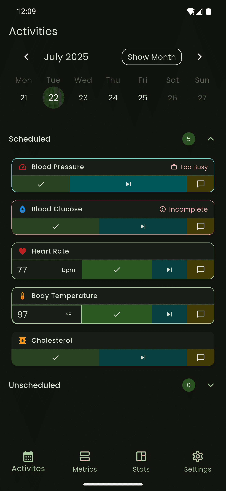
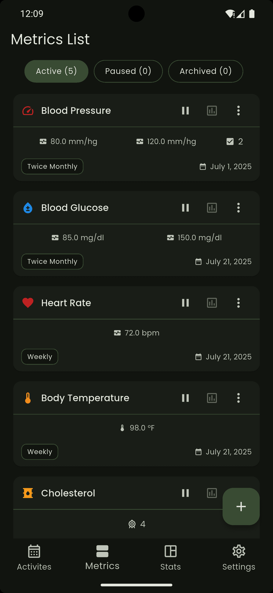
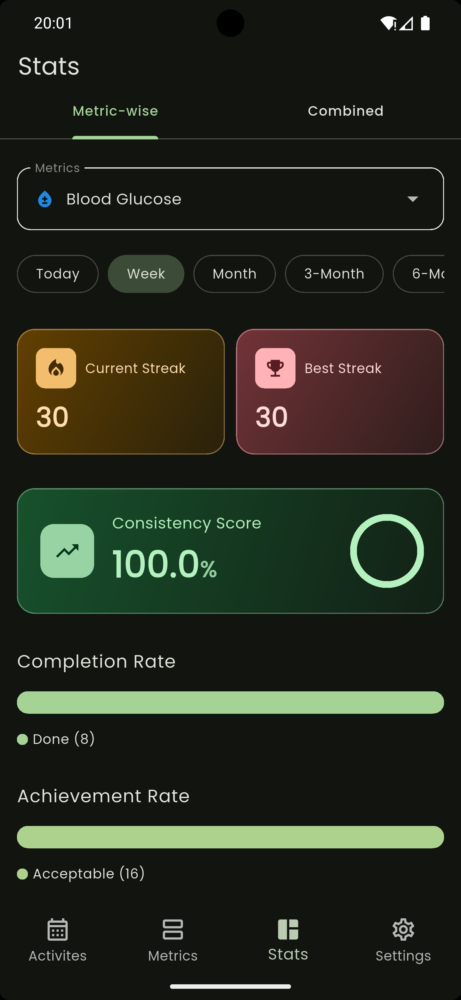
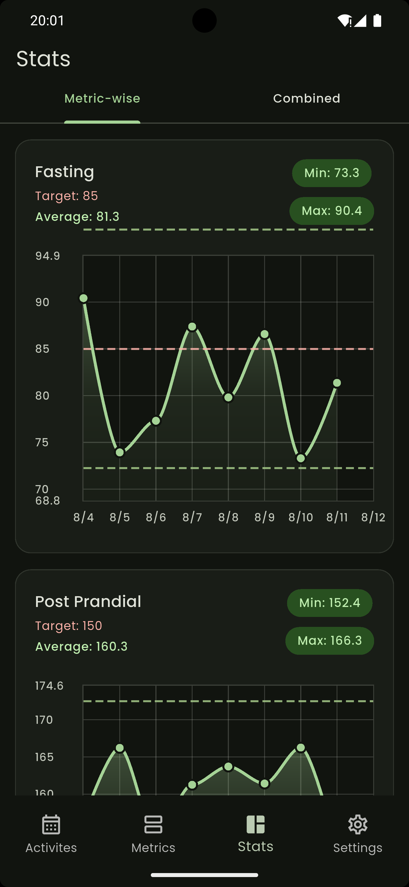
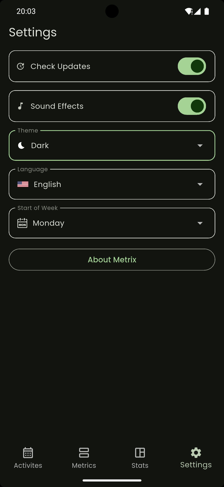
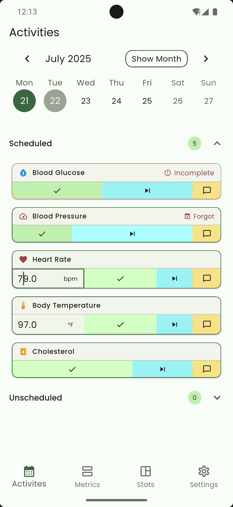
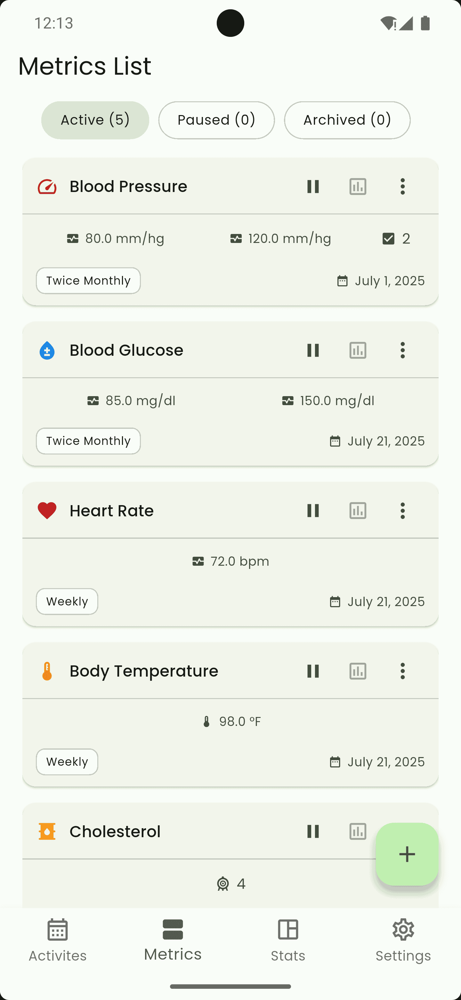
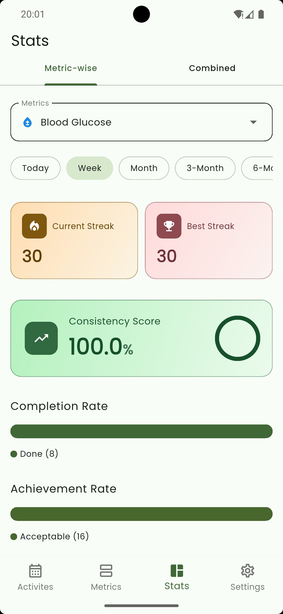
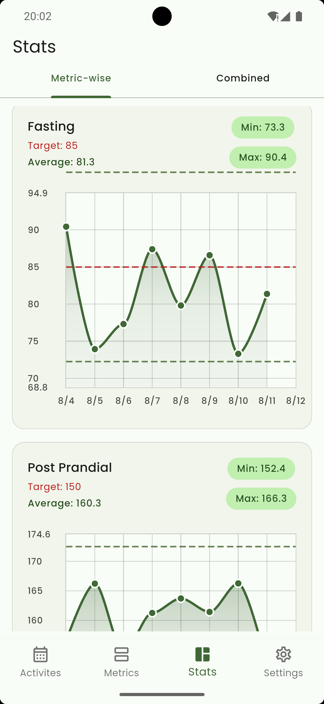
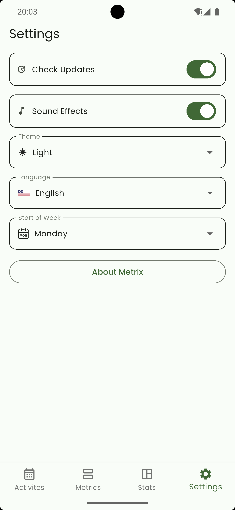

  

<h1 align="center"><strong>Metrix</strong></h1>

**Metrix** by <a href="https://aryawork.com/" target="_blank"><strong>Aryawork</strong></a> is a health tracker app designed to help you **log**, **visualize**, and **optimize** your personal health metrics — all while keeping your data **private and offline**.

Whether you're monitoring blood pressure, blood sugar, weight, sleep, or heart rate, Metrix makes it easy to record, analyze, and understand your health patterns through intuitive charts and summaries.

## 🤝 Commitment

- 🆓 **Always Be Free**  
   Metrix will **NEVER** include any ads, hide current features behind paywall, no hidden cost will be imposed on the app users.

- 🛡️ **No Data Theft**  
   Metrix will **NEVER** collect any data or telemetry from the users.

## ✨ Features

- 🆓 **Completely Free**  
  No ads, no subscriptions, no hidden costs — just a genuinely free health tracker.

- 📈 **Log Essential Health Metrics**  
  - Custom Metric or
  - Predefined
    - Blood Pressure (systolic, diastolic, pulse)
    - Blood Sugar (fasting, post-meal)
    - Weight (lbs/kg)
    - Sleep (duration, quality)
    - Heart Rate (resting pulse)
    - +11 more

- 🧾 **Timestamped Entries with Notes**  
  Add important context to every entry with custom notes and automatic timestamps.

- 🌍 **Multi-Lingual**  
  Support English, and Hindi for now, more languages will be added soon. Contribution in language will be appreciated.

- 📊 **Clean, Responsive Charts**  
  Visualize trends and spot outliers with clear, responsive graphs.

- 📆 **Weekly Summaries**  
  View average, high, and low values for your metrics over time to better understand your progress.

- 🔒 **100% Private & Local Storage**  
  Your data never leaves your device. No accounts, no cloud, no tracking.

- 📱 **Simple & Intuitive Interface**  
  Built for ease of use — no ads, no clutter, just your health data in focus.

- 📴 **Offline-First Experience**  
  Metrix works fully offline, whenever and wherever you need it.

## Screenshots

### Dark

### Light

## 📥 Install

You can download the app via [Releases Page](https://github.com/aryawork-com/metrix/releases) 

OR 

## 🔮 Coming Soon

- 📤 Export to CSV
- ☁️ Optional Cloud Sync (end-to-end encrypted)
- ⏰ Reminders & Smart Notifications
- 🧠 AI-powered Health Insights and Suggestions

## 🛣️ Roadmap

| Feature                              | Status |
| ------------------------------------- | ------ |
| Manual logging of key health data     | ✅ Done |
| Local-only data storage               | ✅ Done |
| Health metric visualizations          | ✅ Done |
| Export to CSV                         | 🔜 Coming |
| Optional cloud sync                   | 🔜 Coming |
| Reminders and smart notifications     | 🔜 Coming |
| AI-driven insights                    | 🔜 Coming |

## 🙋 Contact

Have questions, feedback, or feature ideas?  
Open an issue or start a conversation in [GitHub Discussions](https://github.com/aryawork-com/metrix/discussions).

## 🛡️ Privacy Policy
Visit [Privacy Policy Page](https://aryawork.com/metrix/privacy-policy)

> 🛡️ Your health data is personal. **Metrix will always prioritize privacy, security, and transparency.**
